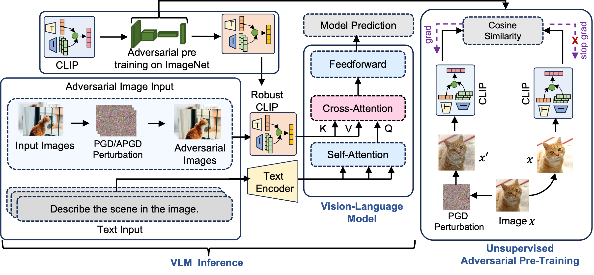

# Sim-CLIP: Unsupervised Siamese Adversarial Fine-Tuning for Robust Visual Language Models

## Abstract

<!--  -->
<p align="center">
  
</p>
<p align="justify">Vision-language models (VLMs) have achieved remarkable performance on multimodal tasks but remain vulnerable to adversarial attacks targeting the vision component. We propose Sim-CLIP, an unsupervised adversarial fine-tuning method that enhances the robustness of the widely-used CLIP vision encoder against such attacks. By employing a Siamese architecture with cosine similarity loss, Sim-CLIP learns semantically meaningful and attack-resilient visual representations without requiring large batch sizes or momentum encoders. We demonstrate that VLMs enhanced with Sim-CLIP's fine-tuned CLIP encoder exhibit significantly enhanced robustness against adversarial attacks, while maintaining high clean accuracy across diverse downstream tasks. Notably, our approach does not require any additional training or fine-tuning of the VLM itself. Simply replacing the original vision encoder with our fine-tuned encoder is sufficient to provide robustness against adversarial attacks. This work underscores the criticality of reinforcing foundational models like CLIP to safeguard the reliability of downstream VLM applications.</p>

## Contents

- [Installation](#installation)
- [Dataset](#dataset)
- [Adversarial Training](#adversarial-training)
- [Models](#models)
- [Evaluation](#evaluation)

## Installation

1. Clone this repository and navigate to the SimCLIP folder:

```
git clone https://github.com/speedlab-git/SimCLIP.git
cd SimCLIP
```

2. We recommend you to use [Anaconda](https://www.anaconda.com/products/distribution) to maintain installed packages and the environment. We use **Python 3.11** for our training and evaluation. Install required packages using the following commands:

```
conda create -n simclip python=3.11 -y
conda activate simclip
pip install -r requirements.txt
```

## Dataset

### Adversarial training dataset

We adversarially pre-train CLIP on the ImageNet dataset. Please download the ImageNet dataset from [here](https://www.image-net.org/download.php) or use the following command:
If you are using windows, please use `linux subsystem (WSL)`

```
wget https://image-net.org/data/ILSVRC/2012/ILSVRC2012_img_val.tar
wget https://image-net.org/data/ILSVRC/2012/ILSVRC2012_img_train.tar
```

After downloading the ImageNet dataset, extract the training and validation data using the provided script in `bash` folder:

```
./bash/imagenet/extract_ILSVRC.sh
```

### Evaluation dataset

<p align="justify">For evaluating the robustness and performance of our fine-tuned CLIP vision encoder, we utilize a diverse set of datasets tailored for different tasks. For Visual Question Answering (VQA)
tasks, we employ the OKVQA and VizWiz datasets, which provide challenging benchmarks for assessing the model's ability to understand and answer questions based on visual content.
For image captioning tasks, we use the COCO and Flickr30k datasets, which are widely recognized for their comprehensive annotations and variety of images. The following table provides download links for each dataset we used in our experiments:<p>

| Dataset Name | Download Link                                                                         |
| ------------ | ------------------------------------------------------------------------------------- |
| OKVQA        | [Download OKVQA](https://okvqa.allenai.org/download.html)                             |
| COCO         | [Download COCO](https://cocodataset.org/#download)                                    |
| Flickr30k    | [Download Flickr30k](https://www.kaggle.com/datasets/hsankesara/flickr-image-dataset) |
| VizWiz       | [Download VizWiz](https://vizwiz.org/tasks-and-datasets/)                             |

<!-- https://huggingface.co/datasets/openflamingo/eval_benchmark/tree/main -->

## Adversarial training

In this repository, we provide scripts for running adversarial training with `FARE` and `TeCoA` alongside our proposed method, Sim-CLIP. We have provided bash scripts for easier execution of these training methods. Each script is tailored to run the respective training method with the necessary configurations. Navigate to the `bash` folder and execute the desired script to start the training process or use given commands in your terminal

### 1. Sim-CLIP<sup>4</sup>

```
python -m train.adversarial_training_simclip --clip_model_name ViT-L-14 --pretrained openai --dataset imagenet --imagenet_root /c/CodesSpring24/Data/imagenet-object-localization-challenge/ILSVRC/Data/CLS-LOC --template std --output_normalize False --steps 10000 --warmup 1400 --batch_size 64 --loss l2 --opt adamw --lr 1e-3 --wd 1e-5 --attack pgd --attack_loss l2 --norm linf --eps 4 --iterations_adv 10 --stepsize_adv 1 --wandb True --output_dir "output directory" --experiment_name SimCLIP4 --log_freq 10
```

or execute the bash script(you can specify the training parameters inside). Make sure you are in the `SimCLIP` folder

```
./bash/training/simclip_train.sh
```

### 2. FARE<sup>4</sup>

```
python -m train.adversarial_training_clip --clip_model_name ViT-L-14 --pretrained openai --dataset imagenet --imagenet_root /c/CodesSpring24/Data/imagenet-object-localization-challenge/ILSVRC/Data/CLS-LOC --template std --output_normalize False --steps 10000 --warmup 1400 --batch_size 64 --loss l2 --opt adamw --lr 1e-5 --wd 1e-4 --attack pgd --inner_loss l2 --norm linf --eps 4 --iterations_adv 10 --stepsize_adv 1 --wandb False --output_dir "output directory" --experiment_name FARE4 --log_freq 10
```

```
./bash/training/fare_train.sh
```

### 3. TeCoA<sup>4</sup>

```
python -m train.adversarial_training_clip_up --clip_model_name ViT-L-14 --pretrained openai --dataset imagenet --imagenet_root /c/CodesSpring24/Data/imagenet-object-localization-challenge/ILSVRC/Data/CLS-LOC --template std --output_normalize False --steps 10000 --warmup 1400 --batch_size 64 --loss ce --opt sgd --lr 1e-3 --wd 1e-5 --attack pgd --inner_loss ce --norm linf --eps 4 --iterations_adv 10 --stepsize_adv 1 --wandb True --output_dir "output directory" --experiment_name TeCOA4 --log_freq 10
```

```
./bash/training/tecoa_train.sh
```

### **Note:**

- Set `--imagenet_root` with the path of your downloaded ImageNet dataset. Set `eps 2` to obtain Sim-CLIP<sup>2</sup>, FARE<sup>2</sup> and TeCoA<sup>2</sup> models
- We recommend a dual GPU setup with a total of 32 GB VRAM. If you are facing any issues with the GPU running out of memory, please reduce the `batch size`
- Modify the `output_dir` parameter to specify the directory to save the model checkpoints

## Models

| Model Name           | Type   | Proposed By              | Download Link                                                 |
| -------------------- | ------ | ------------------------ | ------------------------------------------------------------- |
| CLIP                 | Clean  | OpenAI                   | -                                                             |
| Sim-CLIP<sup>4</sup> | Robust | Our Method               | [Download Sim-CLIP<sup>4</sup>](https://example.com/simclip4) |
| Sim-CLIP<sup>2</sup> | Robust | Our Method               | [Download Sim-CLIP<sup>2</sup>](https://example.com/simclip2) |
| FARE<sup>4</sup>     | Robust | Schlarmann et al. (2024) | [Download FARE<sup>4</sup>](https://example.com/fare4)        |
| FARE<sup>2</sup>     | Robust | Schlarmann et al. (2024) | [Download FARE<sup>2</sup>](https://example.com/fare2)        |
| TeCoA<sup>4</sup>    | Robust | Mao et al. (2023)        | [Download TeCoA<sup>4</sup>](https://example.com/tecoa4)      |
| TeCoA<sup>2</sup>    | Robust | Mao et al. (2023)        | [Download TeCoA<sup>2</sup>](https://example.com/tecoa2)      |

## Evaluation

### Zero-shot Classification

Acquire the classification dataset by visiting the Huggingface CLIP_benchmark repository at [Huggingface CLIP_benchmark](https://huggingface.co/clip-benchmark). Configure the models for evaluation in `CLIP_benchmark/benchmark/models.txt` and specify the datasets in `CLIP_benchmark/benchmark/datasets.txt`. Then execute

````

cd CLIP_benchmark
./bash/run_benchmark_adv.sh

```

### Down-stream tasks evaluation

Before proceeding with Down-stream tasks evaluations, download validation annotations set from [Huggingface openflamingo repository](https://huggingface.co/datasets/openflamingo/eval_benchmark/tree/main)

### Captioning Tasks

- OpenFlamingo

  To evaluate the OpenFlamingo 9B model, first download the model from [here](https://huggingface.co/openflamingo/OpenFlamingo-9B-vitl-mpt7b/tree/main). Then, supply the downloaded annotation set and flamingo checkpoint paths in `/bash/of_eval_9B_coco.sh` . Set the `--vision_encoder_pretrained` parameter to `openai` or provide the path to a fine-tuned CLIP model checkpoint (e.g., Sim-CLIP). Finally, run the evaluation script.

```

./bash/of_eval_9B_coco.sh

```

```

./bash/of_eval_9B_Flickr.sh

```

- LLAVA

  The LLaVA model checkpoint will be automatically downloaded from repository. Update the dataset path with the location of your downloaded dataset and then execute the following command:

```

./bash/llava_eval_coco.sh

```

### Visual Question Answering Tasks

- For VQA, provide the path of the respective VQA dataset in the script and then execute the following commands:

For LLAVA run

```

./bash/llava_eval_okvqa.sh

```

For Flamingo run

```

./bash/of_eval_9B_okvqa.sh

```

```
````
